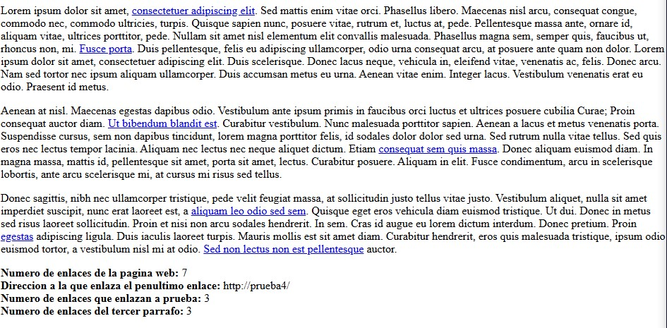
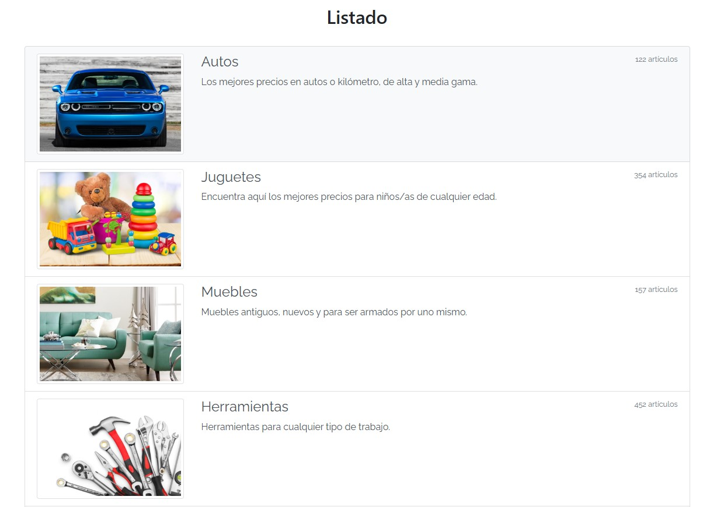

<h1>Semana 4 de Fase 2 de Jóvenes A Programar: En este semana se enfoca en el aprendizaje del DOM y su manipulación.</h1>  

<strong> Practica del DOM con JavaScript -> </strong> El desafió consiste en cumplir los siguientes puntos:  

A partir de la página web adjunta a la tarea, utilizando las funciones DOM y modificando únicamente el archivo mi_script.js, mostrar en pantalla la siguiente información:  

<ol>
    <li>Número de enlaces de la página.</li>
    <li>Dirección a la que enlaza el penúltimo enlace.</li>
    <li>Número de enlaces que enlazan a http://prueba/</li>
    <li>Número de enlaces del tercer párrafo.</li>
</ol>

<strong> El resultado es el siguiente: </strong>   

<strong> Trabajando con JavaScript -> </strong> 

El sitio que adjuntamos debía mostrar un listado que trae desde el servidor, pero nuestros desarrolladores estaban en un mal día y cometieron varios errores…

Trabajando en grupo (Estoy re-haciendo los trabajos de forma individual), deberán localizar los errores que se encuentran en los archivos init.js y listado.js, y corregirlos.

<strong> El resultado es el siguiente: </strong>  

<strong> Desafió Sincrónico 1-> </strong> 

A partir de la página web adjunta a la tarea, utilizando lo aprendido en el teórico de DOM y modificando únicamente el archivo js/script.js, agrega el código necesario para que al dar click en el botón "Resaltar!" se aplique la clase "highlight" al párrafo de id "lorem".  