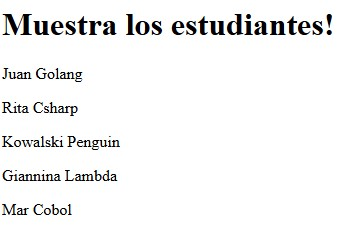

<h1>Semana 7 de Fase 2 de Jóvenes A Programar</h1> 

Se ve temas de manipulación del DOM y fetch

<h2> Taller de Eventos</h2> 

El desafió consiste en cumplir los siguientes puntos:

<ol>
<li>Crea un archivo index.html con la estructura básica y un botón con el texto "Saludar".</li>
<li>Agrega el código necesario en el atributo HTML del botón (button) para que lance una alerta con el texto "Hola!".</li>
<li>Crea un div que contenga al botón. Modifica el estilo del div para que tenga padding de 5px y un fondo verde.</li>
<li>En eventos.js agrega un manejador de eventos para el "click" en el div utilizando el método addEventListener. Debes programar que al dar click en el div salga una alerta con el texto "Hola! Soy el div".</li>
</ol>  

<b> El resultado es el siguiente: </b>

La imagen de arriba es cuando se da click en el div

La imagen de arriba es cuando se da click en el botón

<h2>Taller Fetch_Json</h2>

Jap dara un archivo con los elementos básicos. Luego se deberá modificar el código que se encuentra en el archivo js/script.js para que al momento de cargar la página, muestre nombre y apellido de los estudiantes cargados en json/data.json.

<b>El resultado es el siguiente:</b>

<h2>Taller Formulario de registro</h2>

No se realizará el envío de los datos, estaremos trabajando solo a nivel de cliente. Adjunta encontrarán una página web que consta de un formulario de registro.
Deberán incluirle las validaciones que se listan a continuación:

<ul>
    <li>Ningún campo puede estar vacío.</li>
    <li>La contraseña debe tener al menos 6 caracteres.</li>
    <li>Los datos ingresados en "Contraseña" y "Repetir contraseña" deben ser iguales.</li>
    <li>Se debe haber marcado el checkbox "Acepto los términos y condiciones del servicio."</li>
</ul>

En caso de que los datos ingresados por el usuario cumplan con los criterios establecidos, se deberá llamar a la función showAlertSuccess(), y en caso contrario a la función showAlertError() (ambas funciones ya se encuentran declaradas y se encargan de informar al usuario sobre el resultado).

<b>El resultado es el siguiente:</b>

Trabajo no realizado aun